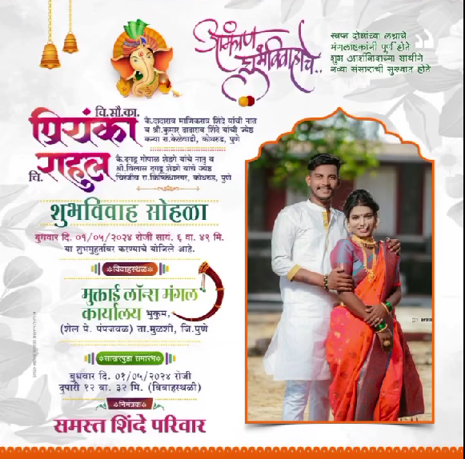

<h1 align="center"><a href="https://pranaydalvi.github.io/wedding-invitation/">Wedding Invitation</a>   SAVE THE DATE: May 01, 2024   <a href="">Rahul Priyanka widding invitation</a></h1>

Welcome to our wedding invitation website repository! This project is built with HTML, CSS, and JavaScript to create a beautiful and interactive platform for inviting your guests to celebrate this special day with you. The website incorporates various features. We've also utilized the ScrollReveal library to add elegant scrolling animations and bring an extra touch of magic to the site.

demo link <href>https://pranaydalvi.github.io/wedding-invitation/</href>
